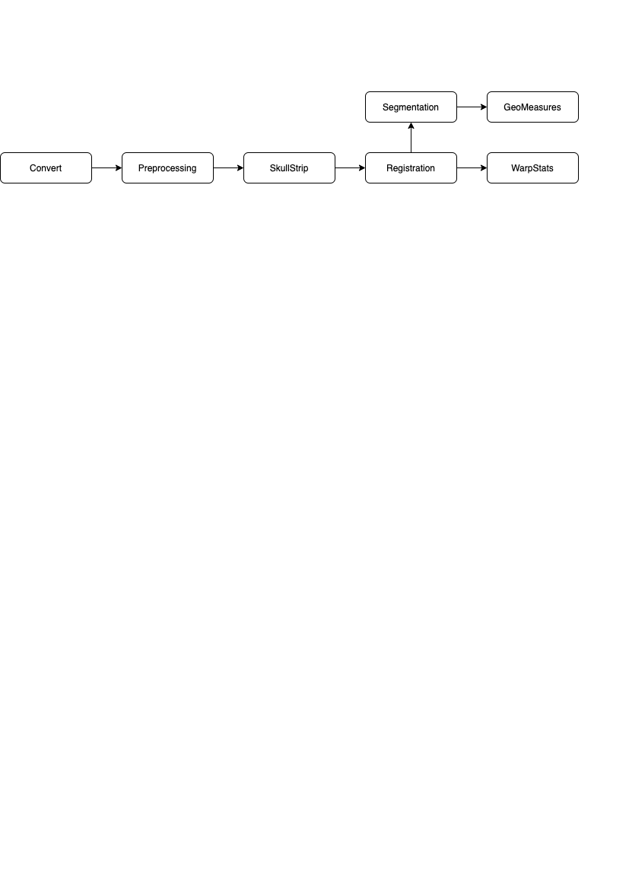
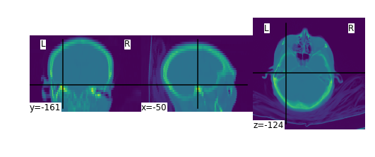
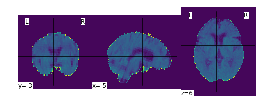
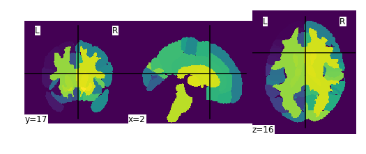
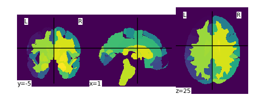

# AutoCT:
    Processing and analyzing brain imaging is crucial in both scientific development and clinical field. In this software package, we build a pipeline that integrates automatic registration, segmentation, and quantitative analysis for subjects’ CT scans. Leveraging diffeomorphic transofrmations, we enable optimized forward and inverse mappings between an image and the reference. Furthermore, we extract localized features from deformation field based on an online template process, which advances statistical learning downstream. The created templates, atlas as well as our methods provide the brain imaging community tools for AI implementations.
         
## Typical Workflow
- Convert dcm files to nii.gz.
- Pre-process image orientation, voxel size/resolution, bias correction and pre-alignment.
- Strip the skull from CT volume.
- Register the skull-stripped CT scan to a given template.
- Segment the skull-stripped CT scan based on a given atlas
- Calculate geometric measures 
- Calculate statistics of warp image for each region of the brain.



## Getting Started
   - Build docker image and use jupyter to run illustration notebook or autoct GUI notebook.
      - Refer to [this document](./docs/docker.md) for a detailed description.
   - Running on NERSC:
      - Refer to [this document](./docs/nersc.md) for a detailed description.

# Sample Workflow Snapshots:

### Convert a series of .dcm files to .nii.gz files.


```python
autoct.convert(pattern='illustration_data/dcmfiles/*',
            out_dir=output, 
            use_dcm2niix=True)
plot_images(join(output, '*', 'convert', "*.nii.gz"))
```

    Plotting output/ID_0eba6ca7-7473dee7c1/convert/ID_0eba6ca7-7473dee7c1.nii.gz:shape=(512, 512, 35)


    

    


### Pre-process and strip the skull from CT volume.


```python
autoct.preprocessing(pattern=join(output, '*', 'convert', '*.nii.gz'), 
                  out_dir=output,
                  mni_file=mni_file)
autoct.skull_strip(pattern=join(output, '*', 'preprocessing', '*.nii.gz'),
                out_dir=output)
plot_images(join(output, '*', 'skull_strip', '*.nii.gz'))
```

    Plotting output/ID_0eba6ca7-7473dee7c1/skull_strip/ID_0eba6ca7-7473dee7c1_brain.nii.gz:shape=(182, 218, 182)


    

    


### Register the skull-stripped CT scan to a template and segment the skull-stripped CT scan based on a given atlas.


```python
autoct.registration(pattern=join(output, '*', 'skull_strip', '*.nii.gz'), 
                 out_dir=output, 
                 template=template_file,
                 transforms=autoct.supported_registration_transforms())
autoct.segmentation(pattern=join(output, '*', 'registration', '*/*.nii.gz'), 
                 out_dir=output, 
                 atlas=atlas_file,
                 types=autoct.supported_segmentation_types())
plot_images(join(output, '*', 'segmentation', '*/*.nii.gz'))
```

    Plotting output/ID_0eba6ca7-7473dee7c1/segmentation/PHYSCi/ID_0eba6ca7-7473dee7c1_segmentation_cortical_phy.nii.gz:shape=(182, 218, 182)


    

    


    Plotting output/ID_0eba6ca7-7473dee7c1/segmentation/AFFINE/ID_0eba6ca7-7473dee7c1_segmentation_cortical_affine.nii.gz:shape=(182, 218, 182)


    

    

****************************

Automated CT registration, segmentation, and quantification (AutoCT) 
=====================
Copyright (c) 2021, The Regents of the University of California,
through Lawrence Berkeley National Laboratory (subject to receipt of
any required approvals from the U.S. Dept. of Energy). All rights reserved.

If you have questions about your rights to use or distribute this software,
please contact Berkeley Lab's Intellectual Property Office at
IPO@lbl.gov.

NOTICE.  This Software was developed under funding from the U.S. Department
of Energy and the U.S. Government consequently retains certain rights.  As
such, the U.S. Government has been granted for itself and others acting on
its behalf a paid-up, nonexclusive, irrevocable, worldwide license in the
Software to reproduce, distribute copies to the public, prepare derivative 
works, and perform publicly and display publicly, and to permit others to do so.

Questions? Contact Zhe Bai (zhebai@lbl.gov) or Talita Perciano (tperciano@lbl.gov)
****************************
