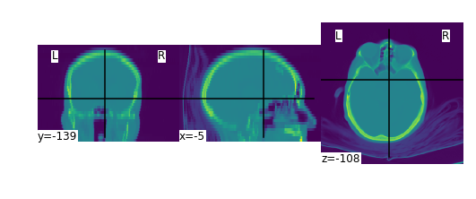
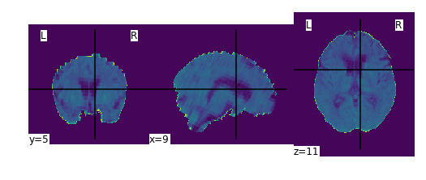
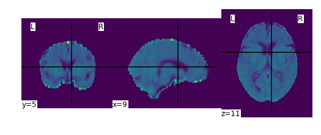
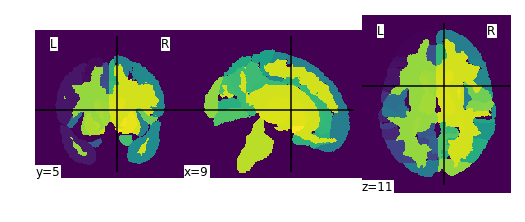
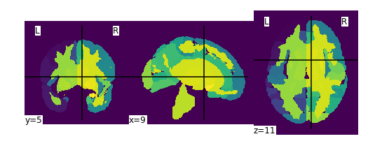

# Automated CT registration, segmentation, and quantification (AutoCT)

Processing and analyzing CT (e.g. brain) imaging is crucial in both 
scientific 
development and clinical field. In this software package, we build a 
pipeline that integrates automatic registration, segmentation, and 
quantitative analysis for subjects' CT scans. Leveraging diffeomorphic transformations, we enable optimized forward and inverse mappings between an image and the reference. Furthermore, we extract localized features from deformation field based on an online template process, which advances statistical learning downstream. The created templates, atlas as well as our methods provide the brain imaging community tools for AI implementations.     

## Typical Workflow
- Convert DICOM files to NIfTI.
- Pre-process image orientation, voxel size/resolution, bias correction and pre-alignment.
- Strip the bone from CT volume.
- Register the bone-stripped CT scan to a given template.
- Segment the bone-stripped CT scan based on a given atlas.
- Calculate geometric measures.
- Calculate statistics of warp image for each region of the brain.


## Installation
   - Use Docker/Jupyter to run illustration notebook and/or runautoct GUI notebook.
      - Refer to [this document](./docs/docker.md) for a detailed description using docker image.
   - Use Bare-metal hosts to run illustration notebook and/or runautoct GUI notebook.
      - You would need to install dependencies as needed
      - Refer to [this document](./docs/baremetal.md) for instructions

## Getting started

See `notebooks/illustration.ipynb` for demonstrating the approach on CT image preprocessing, registration, segmentation and statistical measurements for each region of the brain. 

### Convert a series of .dcm files to .nii.gz files.


```python
autoct.convert(pattern='illustration_data/dcmfiles/*',
            out_dir=output, 
            use_dcm2niix=True)
plot_images(join(output, '*', 'convert', "*.nii.gz"))
```

    Plotting output/ID_0eba6ca7-7473dee7c1/convert/ID_0eba6ca7-7473dee7c1.nii.gz:shape=(512, 512, 35)


    

    


### Pre-process and strip the bone from CT volume.


```python
autoct.preprocessing(pattern=join(output, '*', 'convert', '*.nii.gz'), 
                  out_dir=output,
                  mni_file=mni_file)
autoct.bone_strip(pattern=join(output, '*', 'preprocessing', '*.nii.gz'),
                out_dir=output)
plot_images(join(output, '*', 'bone_strip', '*.nii.gz'))
```

    Plotting output/ID_0eba6ca7-7473dee7c1/bone_strip/ID_0eba6ca7-7473dee7c1_brain.nii.gz:shape=(182, 218, 182)


    

    


### Register the bone-stripped CT scan to a template and segment the bone-stripped CT scan based on a given atlas.


```python
autoct.registration(pattern=join(output, '*', 'bone_strip', '*.nii.gz'), 
                 out_dir=output, 
                 template=template_file,
                 transforms=autoct.supported_registration_transforms())
```
    Plotting data/illustration_workflow_output/ID_0eba6ca7-7473dee7c1/registration/Affine2SyN/ID_0eba6ca7-7473dee7c1_preprocessed_affine2SynWarped.nii.gz:shape=(182, 218, 182)
    
    


    
```python
autoct.segmentation(pattern=join(output, '*', 'registration', '*/*.nii.gz'), 
                 out_dir=output, 
                 atlas=atlas_file,
                 types=autoct.supported_segmentation_types())
plot_images(join(output, '*', 'segmentation', '*/*.nii.gz'))
```

    Plotting output/ID_0eba6ca7-7473dee7c1/segmentation/PHYSCi/ID_0eba6ca7-7473dee7c1_segmentation_cortical_phy.nii.gz:shape=(182, 218, 182)

    

    


    Plotting output/ID_0eba6ca7-7473dee7c1/segmentation/AFFINE/ID_0eba6ca7-7473dee7c1_segmentation_cortical_affine.nii.gz:shape=(182, 218, 182)


    

    
## License (BSD license)
See the [LICENSE file](licence.txt) for details.

****************************

Automated CT registration, segmentation, and quantification (AutoCT) 
Copyright (c) 2021, The Regents of the University of California,
through Lawrence Berkeley National Laboratory (subject to receipt of
any required approvals from the U.S. Dept. of Energy). All rights reserved.

If you have questions about your rights to use or distribute this software,
please contact Berkeley Lab's Intellectual Property Office at
IPO@lbl.gov.

NOTICE.  This Software was developed under funding from the U.S. Department
of Energy and the U.S. Government consequently retains certain rights.  As
such, the U.S. Government has been granted for itself and others acting on
its behalf a paid-up, nonexclusive, irrevocable, worldwide license in the
Software to reproduce, distribute copies to the public, prepare derivative 
works, and perform publicly and display publicly, and to permit others to do so.

Questions? Contact Zhe Bai (zhebai@lbl.gov) or Talita Perciano (tperciano@lbl.gov)
****************************
